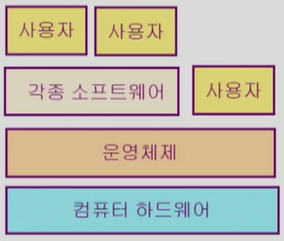

# 운영체제 (Operation Systems, OS)

## 목차

- 운영체제 개요<br>
- 컴퓨터시스템의 구조<br>
- 프로세스 관리<br>
- CPU 스케줄링<br>
- 병행 제어<br>
- 교착상태, 데드락(deadlock)<br>
- 메모리 관리<br>
- 가상 메모리<br>
- 파일 시스템<br>
- 입출력 시스템<br>
- 디스크 관리<br>

<br>
<br>

## :book: 운영체제란?

컴퓨터 하드웨어 바로 위에 설치되어 사용자 및 다른 모든 소프트웨어와 하드웨어를 연결하는 소프트웨어 계층이다.<br>
하드웨어 혹은 소프트웨어, 사용자와 상호작용한다.<br>
PC뿐만 아니라 모바일, 자동차 등에도 OS가 설치된다.

<br>

<p align="center"></img></p>
협의狹義의 운영체제(커널) | 운영체제의 핵심 부분으로 메모리에 상주하는 부분<br>
광의廣義의 운영체제 | 커널 뿐 아니라 각종 주변 시스템 유틸리티를 포함한 개념

<br>

### :pencil: 운영체제의 목표

- 컴퓨터 시스템을 편리하게 사용할 수 있는 환경을 제공한다.<br>
  동시 사용자/프로그램들이 각각 독자적 컴퓨터에서 수행되는 것처럼 보이게 하며 하드웨어를 직접 다루는 복잡한 부분을 운영체제가 대행한다.
- 컴퓨터 시스템의 <span style="color:red;"><i><strong>자원을 효율적으로 관리한다.</strong></i></span><br>
  프로세서(cpu), 기억장치(메모리), 입출력 장치 등의 효율적 관리를 목표로 함.<br>
  cf.) 자원이라는 것은?<br>
  하드웨어적으로는 컴퓨터 안의 cpu나 메모리, 각종 입출력 장치 등을 말하며 소프트웨어적으로는 프로세스, 파일, 메시지 등을 말한다. 운영체제는 이 두 카테고리를 전부 관리하는 것.

<br>

<p align="center"></img></p>

예를 들어 한정된 cpu나 메모리를 어느 간격으로, 얼마만큼의, 누구를 우선으로 할당할 것인가 등을 결정할 때가 있는데, 프로그램 100개가 동시에 실행될 때 CPU를 1/100씩 할당하는 게 효율적인 방안은 아니며 제일 좋은 성능을 뽑아낼 수 있게 하는 것을 항상 강구해야 한다.<br>
또한 너무 효율성만 강구하면 프로그램 간 운영에 있어 차별이 생기게 되므로 형평성 또한 중요하게 생각해야 한다.

<br>

### :pencil: 운영체제의 분류

- 동시 작업 가능 여부
  - 단일 작업(single tasking) | 한 번에 하나의 작업만 처리
  - 다중 작업(multi tasking) | 동시에 두 개 이상의 작업 처리
- 사용자의 수
  - 단일 사용자(single user)
  - 다중 사용자(multi user) | UNIX, NT server 등. 서버에 계정을 여러 개 만들어서 원격으로 다중 접속 가능. 보안 기능 등 부가적으로 생각해야 할 것들이 있다.
- 처리 방식
  - 일괄 처리(batch processing) | 작업 요청을 일정량 모아서 한꺼번에 처리. 작업이 완전 종료될 때까지 기다려야 한다. 요즘은 찾아볼 수 없다.
  - 시분할(time sharing) | 여러 작업을 수행할 때 컴퓨터 처리 능력을 일정한 시간 단위로 분할하여 사용. 짧은 응답 시간을 가진다. interactive한 방식
  - 실시간(Realtime OS) | 정해진 시간 안에 어떠한 일이 반드시 종료됨이 보장되어야 한다. 원자로, 공장 제어, 미사일 제어, 반도체 장비, 로봇 제어 등<br>
    현재는 위와 같은 Hard realtime system만 있는 게 아니라 영화 프레임 등 조금 유동성 있게 사용할 수 있는 Soft realtime system이라는 개념이 확장되었다.

<br>

```
여러 작업을 동시에 수행하는 것을 뜻하는 용어들

- Multitasking
- Multiprogramming | 여러 프로그램이 메모리에 올라가 있음을 강조
- Time sharing | CPU의 시간을 분할하여 나누어 쓴다는 의미를 강조
- Multiprocess

- Multiprocessor | 하나의 컴퓨터에 CPU(processor)가 여러 개 붙어 있음을 의미한다. 위 네 개의 용어와는 달리 하드웨어적으로 다른 시스템
```

<br>

### :pencil: 운영체제의 예

- 유닉스 | 대형컴퓨터를 위해 만들어진 운영체제<br>
  코드의 대부분을 C언어로 작성, 높은 이식성, 최소한의 커널 구조, 복잡한 시스템에 맞게 확장 용이, 소스 코드 공개, 프로그램 개발에 용이, 다양한 버전(System V, FreeBSD, SunOS, Solaris, Linux)
- DOS(Disk Operation System) | 단일 사용자용 운영체제<br>
  메모리 관리 능력의 한계(640KB)
- MS Windows | 개인 컴퓨터를 위해 만들어진 운영체제<br>
  MS사의 다중 작업용 GUI 기반 운영 체제, 불안정성(초기에만 약간 불안정했지 지금은 많이 해소되었다고 함), 풍부한 지원 소프트웨어
- Handheld device를 위한 OS | PalmOS, Pocket PC(Win CE), Tiny OS

<br>

### :pencil: 운영체제의 구조

- CPU 스케줄링<br>
  각 프로그램의 처리 시간을 고려하여 CPU를 할당
- 메모리 관리<br>
  어떤 프로그램에 메모리를 얼마나 할당을 해야 하는지. CPU에서 원활하게 실행하기 위해 필요한 메모리 용량이 있는데, 자주 사용하는 프로그램에는 메모리에서 제거해 버리지 않고, 그게 아닌 것들은 디스크로 빼버린다.
- 파일 관리(Disk)<br>
  디스크에 파일을 보관. 디스크는 HEAD를 이동하며 요청을 처리하는데, 어떻게 하면 HEAD 이동을 최소화하면서 요청을 처리하면 좋을지
- 입출력 관리(I/O device)<br>
  각기 다른 입출력장치와 컴퓨터 간에 어떻게 정보를 주고받게 할지
